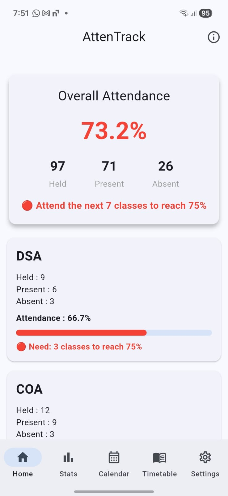
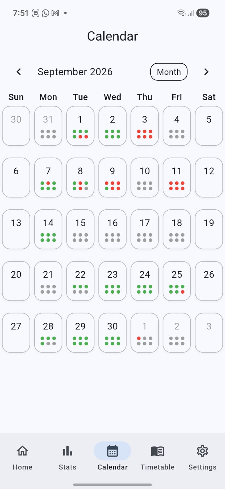
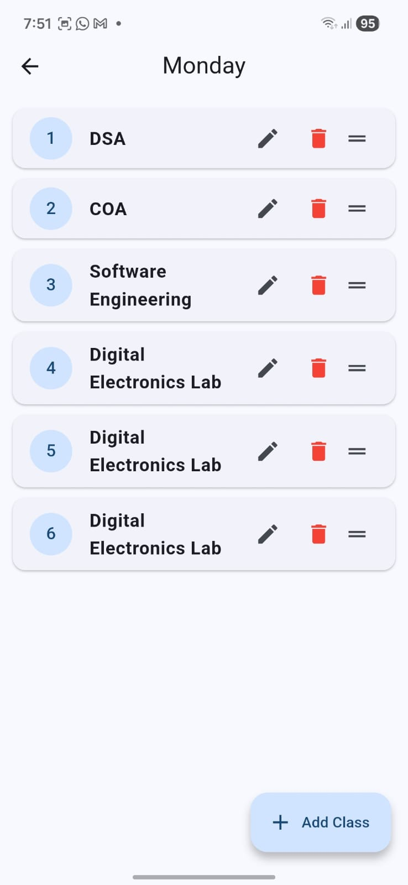
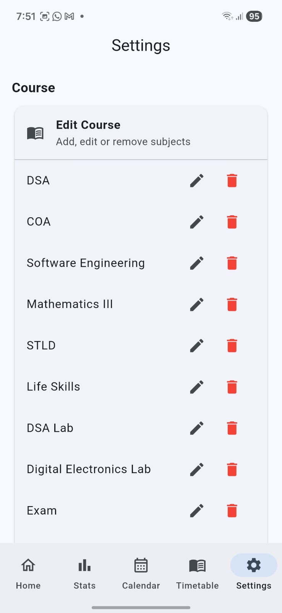

# AttenTrack 📚

A Flutter-based college attendance tracking application developed as a **Semester 3 Software Engineering Project**.

AttenTrack helps students track their attendance, manage their weekly timetable, view attendance history through a calendar, and predict the attendance they need to maintain their required percentage.

## ✨ Features

- 📊 **Overall Attendance**
  - View overall attendance percentage
  - Track attended and missed classes

- 📚 **Subject-wise Attendance**
  - View attendance for individual subjects
  - Visual attendance indicators

- 📅 **Calendar Attendance**
  - View attendance day by day
  - Green, red, and grey indicators for class status

- 🗓️ **Weekly Timetable**
  - Create and manage a weekly class timetable
  - Add, edit, delete, and reorder classes

- ✅ **Attendance Tracking**
  - Mark classes as Present or Absent
  - Attendance is stored locally

- 📈 **Attendance Prediction**
  - Predict classes that need to be attended or can be skipped
  - Helps maintain the required attendance percentage

- 📖 **Subject Management**
  - Add and manage subjects
  - Rename or delete subjects

- 🔄 **Semester Management**
  - Manage subjects according to the current semester

- 💾 **Local Data Storage**
  - Attendance and timetable data are stored locally using Hive

## 🛠️ Tech Stack

- **Flutter**
- **Dart**
- **Hive**
- **Material UI**

## 📱 Platform

AttenTrack is developed using Flutter and can be configured for:

- Android
- Web
- Windows
- Linux
- macOS
- iOS

## 🎓 Academic Project

**Project:** AttenTrack  
**Type:** Semester 3 Software Engineering Project  
**Purpose:** College Attendance Management
## 📱 Screenshots

### 🏠 Home Screen


### 📊 Monthly Analysis


### 📅 Calendar


### 🗓️ Daily Timetable


### ⚙️ Settings


## 🚀 Getting Started

### Prerequisites

Make sure Flutter is installed on your system.

### Installation

Clone the repository:

```bash
git clone https://github.com/Rah4n/AttenTrack.git
